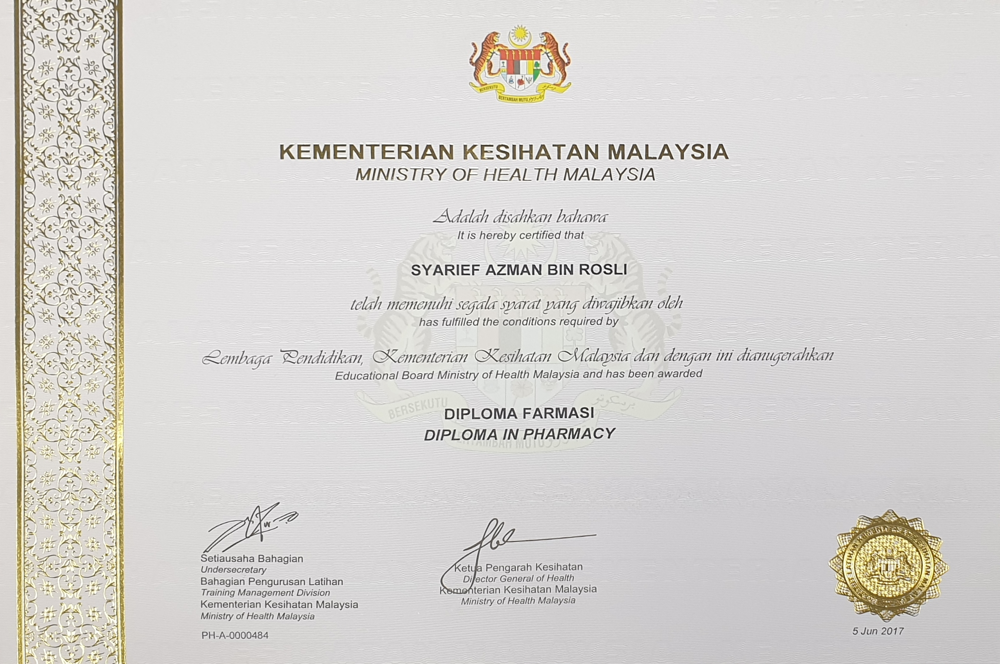

<h1 align="center">Hi 👋, I'm Syarief</h1>

I’m a **Pharmaceutical Analyst** at the National Pharmaceutical Regulatory Agency, where I specialize in testing pharmaceutical products using advanced techniques like **HPLC**, **GC-MS**, and **ICP-MS**. My work focuses on ensuring product safety and compliance with regulatory standards through detailed data analysis and reporting.

<!-- Optional banner -->
<!-- 

    

 -->

  

<!-- Optional gif -->
<!-- 
 
  

 -->

  

  

🌱 **Currently learning**:  
I am pursuing **CS50x – Introduction to Computer Science** and **CS50 Cybersecurity**, where I’m gaining hands-on experience with:

- **Python**
- **C**
- **JavaScript**
- **Cybersecurity fundamentals**

💡 **Goals**:  
I am transitioning into the world of **technology**, aiming to combine my analytical background in pharmaceuticals with software development and cybersecurity. I’m particularly interested in exploring:

- Data automation and analysis
- Cybersecurity in healthcare and pharmaceuticals
- Software development to enhance lab efficiency

📚 **Current Projects**:

- 📝 I made a forex Expert Advisor on [MQL5.com](https://tinyurl.com/eabubuy).
- **CS50x Final Project (In Progress)**: Developing a tool to automate lab data analysis for pharmaceutical testing using Python and JavaScript.
- **Cybersecurity Practice**: Learning how to secure sensitive pharmaceutical data through encryption and best practices in cybersecurity.

⚡ **Fun Fact**:  
In addition to my career in pharmaceuticals, I'm passionate about solving complex problems through coding and exploring how technology can drive innovation in healthcare.

## 🔧 Languages and Tools

## 📫 Let's Connect

- 📫 How to reach me: **<syarief.azman@gmail.com>**.

- 

  
  
  
  
  
  
  

<h3 align="left">Support:</h3>

  

<h2>

📜 Certification (click me to toggle 👀)

- <h6>

Ministry of Health Malaysia

  
  - 

Diploma in Pharmacy

  
    

</h6>

</h2>
  
<h2>📊 Stats</h2>

 
Full Stats (click me to toggle 👀)

  
<!--  -->

<!-- 

  

 -->

<!-- 

  

 -->

<!-- 

  
   -->
  
s

<!-- 
**syarief02/syarief02** is a ✨ _special_ ✨ repository because its `README.md` (this file) appears on your GitHub profile.
-->
