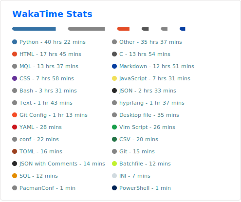
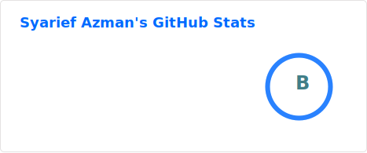

<h1 align="center">
  Hey there 👋 I'm <a href="https://syariefazman.vercel.app">Syarief Azman</a>
</h1>

<h3 align="center">
  🇲🇾 Pharmaceutical Analyst · Algorithmic Trader · Self-Taught Developer
</h3>

<p align='center'>
  <a href="https://eabudakubat.com">
    
  </a>
</p>

<p align="center">
  <a>
    
  </a>
  <a href="https://user-badge.committers.top/malaysia/syarief02">
    
  </a>
  <a href="https://twitter.com/syariefazman" target="blank">
    
  </a>
  <a href="https://syariefazman.vercel.app" target="blank">
    
  </a>
</p>

---

## 🧬 About Me

By day, I'm a **Pharmaceutical Analyst** at the **National Pharmaceutical Regulatory Agency (NPRA)** in Malaysia — running tests on pharmaceutical products using advanced analytical instruments like **HPLC**, **GC-MS**, and **ICP-MS**.

By night, I'm a **self-taught developer** and **algorithmic forex trader** who builds automated trading bots, web apps, and open-source tools. I believe in learning by building, and I ship code every single day.

```
🔬 Pharma by profession     💹 Trader by passion     💻 Developer by obsession
```

---

## 🤖 My Trading Tools — [eabudakubat.com](https://eabudakubat.com)

I build **Expert Advisors (EAs)** for MetaTrader 4 & 5 — automated trading systems that range from grid strategies to AI-powered signal analysis. All designed with real-world trading experience and a strong focus on risk management.

| EA | Strategy | Platform | Description |
|---|---|---|---|
| **[EA Budak Ubat](https://eabudakubat.com)** | Grid Martingale | MT4 / MT5 | 4 analysis methods (Candle, SMA20, Alligator, Ichimoku), AutoConfig AI, hedging & time filters. [Available on MQL5](https://tinyurl.com/eabubuy) |
| **[GoldMind AI](https://eabudakubat.com/goldmind-ai)** | AI-Powered Signals | MT5 | Open-source AI system using ChatGPT to analyze XAUUSD charts & auto-trade. FastAPI + OpenAI + MQL5 |
| **[BracketBlitz EA](https://eabudakubat.com/bracketblitz)** | OCO Breakout | MT4 / MT5 | Rapid-fire Buy Stop + Sell Stop orders, auto-refreshed every 30s. Catches breakouts on any instrument |
| **[MathEdge Pro](https://eabudakubat.com/mathedge-pro)** | Math-Based Index | MT4 / MT5 | Automated US30 & NAS100 trading with daily level calculations & 3-trade pending order sequences |
| **[Aligator Gozaimasu](https://eabudakubat.com/aligator-gozaimasu)** | Trend Following | MT4 / MT5 | Multi-timeframe Alligator + AO + RSI + Stochastic confirmation across up to 4 timeframes |
| **[Encik Moku](https://eabudakubat.com/encik-moku)** | Trend Following | MT4 / MT5 | Multi-timeframe Ichimoku cloud trading with RSI & Stochastic filters, auto-compounding |

---

## 🎨 Frontend Mentor Challenges

I practice frontend skills by completing [Frontend Mentor](https://www.frontendmentor.io/) challenges — all deployed live on GitHub Pages.

| Challenge | Live Demo | Source |
|---|---|---|
| QR Code Component | [Live](https://syarief02.github.io/qr-code-component/) | [Repo](https://github.com/syarief02/qr-code-component) |
| Blog Preview Card | [Live](https://syarief02.github.io/blog-preview-card/) | [Repo](https://github.com/syarief02/blog-preview-card) |
| Social Links Profile | [Live](https://syarief02.github.io/social-links-profile/) | [Repo](https://github.com/syarief02/social-links-profile) |
| Recipe Page | [Live](https://syarief02.github.io/recipe-page-main/) | [Repo](https://github.com/syarief02/recipe-page-main) |
| Four Card Feature Section | [Live](https://syarief02.github.io/four-card-feature-section/) | [Repo](https://github.com/syarief02/four-card-feature-section) |
| Testimonials Grid Section | [Live](https://syarief02.github.io/testimonials-grid-section/) | [Repo](https://github.com/syarief02/testimonials-grid-section) |

---

## 🔧 Skills & Tools

<p align="center">
  
  
  
  
  
  
  
  
  
  
  
  
  
  
</p>

---

## 🚀 What I'm Up To

- 💼 **[Portfolio](https://syariefazman.vercel.app)** — my developer portfolio showcasing projects, skills & journey
- 📄 **[Resume](https://syariefazman.vercel.app/resume.html)** — my up-to-date resume with print-to-PDF
- 🤖 **Building & shipping** Expert Advisors — helping traders automate their edge
- 🧠 **GoldMind AI** — an open-source system that connects ChatGPT to MetaTrader 5 for AI-driven gold trading
- 🌐 **[eabudakubat.com](https://eabudakubat.com)** — my product website built with Next.js & Supabase
- 📚 **Learning**: CS50x (Computer Science) & CS50 Cybersecurity from Harvard
- 🔐 **Exploring** secure practices for pharmaceutical data through encryption
- ⚡ **Automating** laboratory workflows & data analysis with Python and Excel

---

## 🏆 Achievements

<div align="center">

[](https://github.com/syarief02#gh-dark-mode-only)
[](https://github.com/syarief02#gh-light-mode-only)

</div>

<div align="center">

[](https://github.com/syarief02#gh-light-mode-only)
[](https://github.com/syarief02#gh-dark-mode-only)

</div>

---

## 📜 Certification

<details>
<summary>Ministry of Health Malaysia — Diploma in Pharmacy</summary>
<br>

</details>

---

## ⚡ Fun Fact

My career started in a pharmaceutical lab, but every night I trade forex and write code. I've gone from manually testing pills to building AI-powered trading bots and full-stack websites — all self-taught. I prove every day that you don't need a CS degree to ship real software.

---

## 📫 Connect With Me

<p align="center">
  <a href="https://t.me/SyariefAzman" target="_blank">
    
  </a>
  <a href="https://twitter.com/syariefazman" target="_blank">
    
  </a>
  <a href="https://linkedin.com/in/syariefazman" target="_blank">
    
  </a>
  <a href="https://fb.com/syariefazman" target="_blank">
    
  </a>
  <a href="https://stackoverflow.com/users/22780408/syarief-azman" target="_blank">
    
  </a>
  <a href="https://youtube.com/syariefazman" target="_blank">
    
  </a>
  <a href="https://discord.gg/DhUstUpSuu" target="_blank">
    
  </a>
  <a href="https://t.me/EABudakUbat" target="_blank">
    
  </a>
  <a href="https://www.mql5.com/en/channels/eabudakubat" target="_blank">
    
  </a>
</p>

<p align="center">
  📧 <strong><a href="mailto:syarief.azman@gmail.com">syarief.azman@gmail.com</a></strong>
</p>

---

<h3 align="left">☕ Support My Work</h3>
<p>
  <a href="https://paypal.me/syariefazman">
    
  </a>
</p>

---

## 📊 Stats

[](https://github.com/syarief02#gh-light-mode-only)

[](https://github.com/syarief02#gh-dark-mode-only)

[](https://github.com/syarief02)

<details open=""><summary>Full Stats (click me to toggle 👀)</summary><br>

<!--START_SECTION:waka-->


**🐱 My GitHub Data** 

> 📦 1.1 MB Used in GitHub's Storage 
 > 
> 🏆 2,270 Contributions in the Year 2026
 > 
> 💼 Opted to Hire
 > 
> 📜 57 Public Repositories 
 > 
> 🔑 9 Private Repositories 
 > 
**I'm an Early 🐤** 

```text
🌞 Morning                13040 commits       ⣿⣿⣿⣿⣿⣿⣿⣀⣀⣀⣀⣀⣀⣀⣀⣀⣀⣀⣀⣀⣀⣀⣀⣀⣀   27.03 % 
🌆 Daytime                11761 commits       ⣿⣿⣿⣿⣿⣿⣀⣀⣀⣀⣀⣀⣀⣀⣀⣀⣀⣀⣀⣀⣀⣀⣀⣀⣀   24.38 % 
🌃 Evening                12251 commits       ⣿⣿⣿⣿⣿⣿⣀⣀⣀⣀⣀⣀⣀⣀⣀⣀⣀⣀⣀⣀⣀⣀⣀⣀⣀   25.39 % 
🌙 Night                  11194 commits       ⣿⣿⣿⣿⣿⣿⣀⣀⣀⣀⣀⣀⣀⣀⣀⣀⣀⣀⣀⣀⣀⣀⣀⣀⣀   23.20 % 
```
📅 **I'm Most Productive on Sunday** 

```text
Monday                   6774 commits        ⣿⣿⣿⣿⣀⣀⣀⣀⣀⣀⣀⣀⣀⣀⣀⣀⣀⣀⣀⣀⣀⣀⣀⣀⣀   14.04 % 
Tuesday                  6688 commits        ⣿⣿⣿⣀⣀⣀⣀⣀⣀⣀⣀⣀⣀⣀⣀⣀⣀⣀⣀⣀⣀⣀⣀⣀⣀   13.86 % 
Wednesday                6761 commits        ⣿⣿⣿⣿⣀⣀⣀⣀⣀⣀⣀⣀⣀⣀⣀⣀⣀⣀⣀⣀⣀⣀⣀⣀⣀   14.01 % 
Thursday                 7032 commits        ⣿⣿⣿⣿⣀⣀⣀⣀⣀⣀⣀⣀⣀⣀⣀⣀⣀⣀⣀⣀⣀⣀⣀⣀⣀   14.58 % 
Friday                   6920 commits        ⣿⣿⣿⣿⣀⣀⣀⣀⣀⣀⣀⣀⣀⣀⣀⣀⣀⣀⣀⣀⣀⣀⣀⣀⣀   14.34 % 
Saturday                 6690 commits        ⣿⣿⣿⣀⣀⣀⣀⣀⣀⣀⣀⣀⣀⣀⣀⣀⣀⣀⣀⣀⣀⣀⣀⣀⣀   13.87 % 
Sunday                   7381 commits        ⣿⣿⣿⣿⣀⣀⣀⣀⣀⣀⣀⣀⣀⣀⣀⣀⣀⣀⣀⣀⣀⣀⣀⣀⣀   15.30 % 
```


📊 **This Week I Spent My Time On** 

```text
🕑︎ Time Zone: Asia/Singapore

💬 Programming Languages: 
Other                    5 hrs 35 mins       ⣿⣿⣿⣿⣿⣿⣿⣿⣀⣀⣀⣀⣀⣀⣀⣀⣀⣀⣀⣀⣀⣀⣀⣀⣀   32.90 % 
Markdown                 4 hrs 11 mins       ⣿⣿⣿⣿⣿⣿⣀⣀⣀⣀⣀⣀⣀⣀⣀⣀⣀⣀⣀⣀⣀⣀⣀⣀⣀   24.67 % 
Python                   3 hrs 59 mins       ⣿⣿⣿⣿⣿⣿⣀⣀⣀⣀⣀⣀⣀⣀⣀⣀⣀⣀⣀⣀⣀⣀⣀⣀⣀   23.53 % 
JavaScript               1 hr 10 mins        ⣿⣿⣀⣀⣀⣀⣀⣀⣀⣀⣀⣀⣀⣀⣀⣀⣀⣀⣀⣀⣀⣀⣀⣀⣀   06.92 % 
MQL                      1 hr 2 mins         ⣿⣿⣀⣀⣀⣀⣀⣀⣀⣀⣀⣀⣀⣀⣀⣀⣀⣀⣀⣀⣀⣀⣀⣀⣀   06.10 % 

🔥 Editors: 
Antigravity              7 hrs 59 mins       ⣿⣿⣿⣿⣿⣿⣿⣿⣿⣿⣿⣿⣀⣀⣀⣀⣀⣀⣀⣀⣀⣀⣀⣀⣀   46.99 % 
Bash                     5 hrs 34 mins       ⣿⣿⣿⣿⣿⣿⣿⣿⣀⣀⣀⣀⣀⣀⣀⣀⣀⣀⣀⣀⣀⣀⣀⣀⣀   32.81 % 
VS Code                  3 hrs 20 mins       ⣿⣿⣿⣿⣿⣀⣀⣀⣀⣀⣀⣀⣀⣀⣀⣀⣀⣀⣀⣀⣀⣀⣀⣀⣀   19.69 % 
Vim                      5 mins              ⣀⣀⣀⣀⣀⣀⣀⣀⣀⣀⣀⣀⣀⣀⣀⣀⣀⣀⣀⣀⣀⣀⣀⣀⣀   00.52 % 

💻 Operating System: 
Linux                    9 hrs 32 mins       ⣿⣿⣿⣿⣿⣿⣿⣿⣿⣿⣿⣿⣿⣿⣀⣀⣀⣀⣀⣀⣀⣀⣀⣀⣀   56.15 % 
Windows                  7 hrs 27 mins       ⣿⣿⣿⣿⣿⣿⣿⣿⣿⣿⣿⣀⣀⣀⣀⣀⣀⣀⣀⣀⣀⣀⣀⣀⣀   43.85 % 
```

**I Mostly Code in MQL4** 

```text
MQL4                     19 repos            ⣿⣿⣿⣿⣿⣿⣿⣿⣿⣀⣀⣀⣀⣀⣀⣀⣀⣀⣀⣀⣀⣀⣀⣀⣀   35.85 % 
HTML                     13 repos            ⣿⣿⣿⣿⣿⣿⣀⣀⣀⣀⣀⣀⣀⣀⣀⣀⣀⣀⣀⣀⣀⣀⣀⣀⣀   24.53 % 
CSS                      7 repos             ⣿⣿⣿⣀⣀⣀⣀⣀⣀⣀⣀⣀⣀⣀⣀⣀⣀⣀⣀⣀⣀⣀⣀⣀⣀   13.21 % 
JavaScript               4 repos             ⣿⣿⣀⣀⣀⣀⣀⣀⣀⣀⣀⣀⣀⣀⣀⣀⣀⣀⣀⣀⣀⣀⣀⣀⣀   07.55 % 
MQL5                     3 repos             ⣿⣀⣀⣀⣀⣀⣀⣀⣀⣀⣀⣀⣀⣀⣀⣀⣀⣀⣀⣀⣀⣀⣀⣀⣀   05.66 % 
```


 Last Updated on 01/03/2026 07:14:30 UTC
<!--END_SECTION:waka-->

[](https://github.com/syarief02)


## 📈 My LeetCode Stats  

[](https://leetcode.com/u/SyariefAzman#gh-dark-mode-only)  

[](https://leetcode.com/u/SyariefAzman#gh-light-mode-only)

</details>

<!-- 
**syarief02/syarief02** is a ✨ _special_ ✨ repository because its `README.md` (this file) appears on your GitHub profile.
-->
