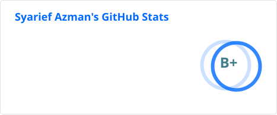
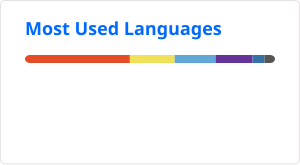
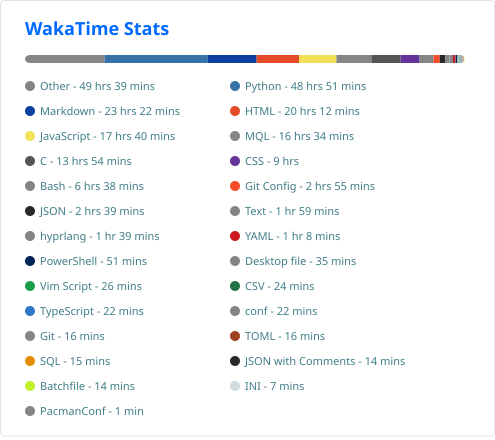

<h1 align="center">
  Hey there 👋 I'm <a href="https://syariefazman.com">Syarief Azman</a>
</h1>

<h3 align="center">
  Pharmaceutical Analyst turned Software Developer · Quantitative Systems Architect
</h3>

<p align="center">
  <em>"Where Chemistry Meets Code — Pharma Lab by Day. Code Editor by Night."</em>
</p>

<p align="center">
  <a href="https://syariefazman.com">
    
  </a>
</p>

<p align="center">
  <a href="https://syariefazman.com" target="_blank">
    
  </a>
  <a href="https://eabudakubat.com" target="_blank">
    
  </a>
  <a href="https://www.mql5.com/en/market/product/195399" target="_blank">
    
  </a>
  <a href="https://komarev.com/ghpvc/?username=syarief02&label=PROFILE+VIEWS&color=00f0ff&style=for-the-badge">
    
  </a>
  <a href="https://user-badge.committers.top/malaysia/syarief02">
    
  </a>
</p>

<p align="center">
  <a href="https://syariefazman.com"><b>🌐 Portfolio Website</b></a> •
  <a href="https://syariefazman.com/resume.html"><b>📄 Resume</b></a> •
  <a href="https://syariefazman.com/cv.html"><b>📋 Curriculum Vitae</b></a> •
  <a href="https://syariefazman.com/lab"><b>🔬 NPRA Lab Hub</b></a> •
  <a href="https://eabudakubat.com"><b>🤖 EA Ecosystem</b></a> •
  <a href="https://syariefazman.com#guestbook"><b>💬 Live Guestbook</b></a> •
  <a href="https://syariefazman.com#arcade"><b>🎮 Retro Arcade</b></a>
</p>

---

## 🧬 About Me — Where Chemistry Meets Code

I am a **Pharmaceutical Analyst** turned **Software Developer & Quantitative Systems Architect** based in Malaysia. I bridge the gap between empirical laboratory sciences and production-grade software engineering.

By day, I operate at Malaysia's **National Pharmaceutical Regulatory Agency (NPRA)**, ensuring pharmaceutical safety, quality, and regulatory compliance through zero-margin-for-error analytical testing on advanced instrumentation (HPLC, GC-MS, ICP-MS) and ISO calibration protocols (ISO 8655-2, ISO 4787, GLP).

When the lab closes, I dive into code. As a self-taught engineer, I have authored over **2.94 million lines of code**, engineered a proprietary suite of MetaTrader algorithmic trading systems, created AI-to-broker execution bridges, and shipped modern reactive full-stack web applications.

```text
🔬 High-Precision Metrology & QC   ⇄   💹 Algorithmic Trading Systems   ⇄   💻 2.94M+ Lines of Code Authored
```

- 🌐 **Primary Portfolio & Hub:** [syariefazman.com](https://syariefazman.com) — Featuring live projects, interactive SOP guides, retro Dino arcade game, and real-time guestbook.
- 🏢 **Fintech & Trading Ecosystem:** Founder & Lead Architect of [EA Budak Ubat](https://eabudakubat.com) — 12+ years continuous evolution since 2014, serving 900+ active global traders.
- 🎓 **Continuous Computer Science Education:** Harvard University [CS50x](https://cs50.harvard.edu/x/) & [CS50 Cybersecurity](https://cs50.harvard.edu/cybersecurity/).
- ⚡ **Engineering Discipline:** Translating empirical scientific methods into software: hypothesis-driven development, deterministic risk guards, tick-level execution, and resilient cloud backends.

---

## 🔬 Pharmaceutical Metrology & Lab Applications — [syariefazman.com/lab](https://syariefazman.com/lab)

Web applications, interactive SOP decision matrices, and scientific tools developed to streamline high-precision laboratory workflows and regulatory testing:

| Application / Resource | Domain / Focus | Live Portal | Source |
|---|---|---|---|
| **NPRA Lab Hub & Competency** | Seksyen Pengujian Produk & Kosmetik multi-unit reference hub (Penyaringan, Logam Berat, Verifikasi). | [Live Portal](https://syariefazman.com/lab) | Portfolio Integrated |
| **Unit Penyaringan — Sasaran 2026** | Interactive web slide deck mapping workload additions & operational targets. | [Live Deck](https://syariefazman.com/uptslide1) | [Repo](https://github.com/syarief02/uptslide1) |
| **Uniformity of Weight Guide** | PKKK/300/UAT/037 & USP 43 <2091> interactive decision flows, limits & batch calculations. | [Live Tool](https://syariefazman.com/uow) | [Repo](https://github.com/syarief02/Uniformity-of-Weight) |
| **Agilent 8900 ICP-MS Guide** | Comprehensive 7-chapter operation guide: startup, MassHunter tuning, USP 233 sample prep & compliance. | [Live Guide](https://syariefazman.com/icpms) | [Repo](https://github.com/syarief02/ICPMS-agilent-8900) |
| **Solid Phase Extraction (SPE) Guide** | Standardized SPE workflows, sorbent chemistry, and sample clean-up methodologies. | [Live Guide](https://syariefazman.com/spe) | Portfolio Integrated |
| **Balik Kampung Checklist** | Interactive packing & preparation checklist with category filters, progress indicators & localStorage. | [Live Tool](https://syariefazman.com/checklist) | [Repo](https://github.com/syarief02/balik-kampung-checklist) |

---

## 🤖 Flagship Algorithmic Trading Ecosystem — [eabudakubat.com](https://eabudakubat.com)

Battle-tested MetaTrader Expert Advisors, AI-driven signal engines, and execution cockpits engineered for distinct market regimes:

| System | Strategy & Mechanics | Platform | Key Architecture |
|---|---|---|---|
| **[EA Budak Ubat v1.67](https://eabudakubat.com/ea-budak-ubat)** | Dynamic Grid Martingale | MT4 / MT5 | 4 analysis modes (Candle, SMA20, Alligator, Ichimoku), AutoConfig AI volatility engine, real-time tick basket break-even. [MQL5 Market #195399](https://www.mql5.com/en/market/product/195399) |
| **[GoldMind AI v1.01](https://eabudakubat.com/goldmind-ai)** | AI Vision Execution Engine | MT5 | Autonomous AI trading system connecting OpenAI GPT models with MetaTrader 5 via local FastAPI backend. [Repo](https://github.com/syarief02/goldmind-ai) |
| **[BracketBlitz EA](https://eabudakubat.com/bracketblitz)** | OCO Straddle Breakout | MT4 / MT5 | Rapid-fire OCO bracket orders straddling market price (Buy Stop + Sell Stop) auto-refreshed every 30 seconds for news momentum. |
| **[MathEdge Pro v1.1](https://eabudakubat.com/mathedge-pro)** | Math-Based Index Bias | MT4 / MT5 | Automated daily OHLC level matrix for US30 & NAS100 with strict 3-trade pending sequence executed during the NY session. |
| **[Aligator Gozaimasu v1.06](https://eabudakubat.com/aligator-gozaimasu)** | Multi-Timeframe Trend | MT4 / MT5 | Trend-following system combining Bill Williams Alligator, Awesome Oscillator, RSI, and Stochastic confirmed across 4 timeframes. |
| **[Encik Moku v1.06](https://eabudakubat.com/encik-moku)** | MTF Ichimoku Cloud | MT4 / MT5 | Multi-timeframe Ichimoku Kinko Hyo trend system confirmed above/below the Kumo cloud with auto-compounding & martingale recovery. |
| **[Kinetix Speed Commander](https://eabudakubat.com/products)** | Execution HUD & Risk Cockpit | MT4 | Institutional one-click execution cockpit, dynamic balance/equity % lot sizing, and 250ms high-frequency trailing stop automation. |
| **[Stratos Momentum Engine](https://eabudakubat.com/products)** | Linear Regression Breakout | MT5 | H1 Linear Regression slope filter, M15 Stochastic crossover timing, Donchian breakout confirmation, and Chandelier ATR trailing stop. |
| **[Vortex Confluence Radar](https://eabudakubat.com/products)** | Multi-Oscillator Scoring | MT4 | Tri-oscillator momentum fusion (RVI + CCI + Williams %R) into a unified histogram with EMA signal alerts. [MQL5 #196875](https://www.mql5.com/en/market/product/196875) |
| **[Indi RBO](https://eabudakubat.com/products)** | Range Breakout Box | MT4 | Configurable session high/low breakout box indicator with projected volatility expansion targets. [MQL5 #146992](https://www.mql5.com/en/market/product/146992) |

---

## 🎨 Full-Stack Web & Open Source Applications

Production web applications and responsive UI implementations deployed on Vercel and GitHub Pages:

| Project | Stack | Live Demo | Source |
|---|---|---|---|
| **Syarief Azman Portfolio** | HTML5, CSS3, JavaScript, Supabase, Vercel | [syariefazman.com](https://syariefazman.com) | [Repo](https://github.com/syarief02/syarief02) |
| **EA Budak Ubat Web Hub** | Next.js 16, React, Supabase, Tailwind CSS, Vercel | [eabudakubat.com](https://eabudakubat.com) | [Repo](https://github.com/syarief02/EA_Budak_Ubat_MT5_Public) |
| **QR Code Component** | HTML5, Modern CSS Flexbox | [Live Demo](https://syarief02.github.io/qr-code-component/) | [Repo](https://github.com/syarief02/qr-code-component) |
| **Blog Preview Card** | HTML5, Responsive CSS Grid | [Live Demo](https://syarief02.github.io/blog-preview-card/) | [Repo](https://github.com/syarief02/blog-preview-card) |
| **Social Links Profile** | Semantic HTML, CSS Transitions | [Live Demo](https://syarief02.github.io/social-links-profile/) | [Repo](https://github.com/syarief02/social-links-profile) |
| **Four Card Feature Section** | Multi-Column CSS Grid Layout | [Live Demo](https://syarief02.github.io/four-card-feature-section/) | [Repo](https://github.com/syarief02/four-card-feature-section) |
| **Testimonials Grid Section** | Advanced Asymmetric CSS Grid | [Live Demo](https://syarief02.github.io/testimonials-grid-section/) | [Repo](https://github.com/syarief02/testimonials-grid-section) |

---

## 💬 Real-Time Community Guestbook — Powered by Supabase

My personal portfolio features a live, community-driven guestbook powered directly by a **Supabase PostgreSQL** backend and REST API:

- ⚡ **Instant Publishing:** Traders, collaborators, and visitors can post feedback, feature ideas, and EA requests in real time.
- 🛡️ **Zero Friction & Moderation:** Anti-bot honeypot protection, category tagging (`Feedback`, `Idea`, `EA Request`), and dynamic live feed updates.
- ✍️ **Leave Your Mark:** Come say hi or leave your feedback on the live wall:  
  👉 **[Sign the Guestbook on syariefazman.com](https://syariefazman.com#guestbook)**

---

## 🔧 Technology Stack & Capabilities

<p align="center">
  
  
  
  
  
  
  
  
  
  
  
  
  
  
  
  
</p>

### 💻 Architecture & Systems Breakdown
- **Quantitative Trading & Execution:** MetaTrader 4 & 5 API, native MQL4/MQL5 Expert Advisors, dynamic Average Daily Range (ADR) algorithms, multi-layer drawdown controls, tick basket break-even engines.
- **Backend, APIs & AI Pipelines:** Python 3, FastAPI, OpenAI GPT Vision integration, RESTful endpoints, Supabase Database & Auth, PostgreSQL relational data structures.
- **Frontend & Web Interfaces:** Next.js (App Router), React, TypeScript, Tailwind CSS, semantic HTML5, responsive CSS Grid/Flexbox, dynamic Canvas visualizations.
- **Scientific Metrology & Analytical Rigor:** Ultra High-Performance Liquid Chromatography (UHPLC/HPLC), Gas Chromatography–Mass Spectrometry (GC-MS), ICP-MS, volumetric calibration (ISO 8655-2, ISO 4787), Good Laboratory Practice (GLP).
- **DevOps & Edge Deployment:** Git version control, GitHub Actions automated CI/CD pipelines, Cloudflare DNS & edge caching, Vercel deployments.

---

## 📜 Education & Certifications

- 🎓 **Harvard University CS50x:** Introduction to Computer Science (C, Python, SQL, Algorithms, Memory, Data Structures)
- 🛡️ **Harvard University CS50 Cybersecurity:** Secure Software Design, Cryptography, Defensive Engineering & Threat Modeling
- 🧪 **Ministry of Health Malaysia:** Diploma in Pharmacy (Analytical Chemistry & Clinical Pharmacology Foundation)
- 🔬 **Shimadzu Malaysia:** Ultra High-Performance Liquid Chromatography Theory & Practical with LabSolutions
- ⚗️ **NIC / Orbiting Scientific:** RA-4300A Mercury Analyzer Operational Training & Instrument Maintenance

---

## 🏆 Achievements & Contribution Graphs

<div align="center">

[](https://github.com/syarief02#gh-dark-mode-only)
[](https://github.com/syarief02#gh-light-mode-only)

</div>

<div align="center">

[](https://github.com/syarief02#gh-light-mode-only)
[](https://github.com/syarief02#gh-dark-mode-only)

</div>

---

## 📊 Live Coding Analytics

<p align="center">
  <a href="https://github.com/syarief02#gh-light-mode-only">
    
  </a>
  <a href="https://github.com/syarief02#gh-dark-mode-only">
    
  </a>
</p>

<p align="center">
  <a href="https://github.com/syarief02">
    
  </a>
  <a href="https://github.com/syarief02">
    
  </a>
</p>

<p align="center">
  <a href="https://github.com/syarief02">
    
  </a>
</p>

<details open=""><summary>Full Coding Stats & Commit Rhythms (click to toggle 👀)</summary><br>

<!--START_SECTION:waka-->


**🐱 My GitHub Data** 

> 📦 1.7 MB Used in GitHub's Storage 
 > 
> 🏆 7,687 Contributions in the Year 2026
 > 
> 💼 Opted to Hire
 > 
> 📜 64 Public Repositories 
 > 
> 🔑 19 Private Repositories 
 > 
**I'm an Early 🐤** 

```text
🌞 Morning                15311 commits       ⣿⣿⣿⣿⣿⣿⣿⣀⣀⣀⣀⣀⣀⣀⣀⣀⣀⣀⣀⣀⣀⣀⣀⣀⣀   26.81 % 
🌆 Daytime                13700 commits       ⣿⣿⣿⣿⣿⣿⣀⣀⣀⣀⣀⣀⣀⣀⣀⣀⣀⣀⣀⣀⣀⣀⣀⣀⣀   23.99 % 
🌃 Evening                14583 commits       ⣿⣿⣿⣿⣿⣿⣀⣀⣀⣀⣀⣀⣀⣀⣀⣀⣀⣀⣀⣀⣀⣀⣀⣀⣀   25.54 % 
🌙 Night                  13508 commits       ⣿⣿⣿⣿⣿⣿⣀⣀⣀⣀⣀⣀⣀⣀⣀⣀⣀⣀⣀⣀⣀⣀⣀⣀⣀   23.66 % 
```
📅 **I'm Most Productive on Sunday** 

```text
Monday                   8069 commits        ⣿⣿⣿⣿⣀⣀⣀⣀⣀⣀⣀⣀⣀⣀⣀⣀⣀⣀⣀⣀⣀⣀⣀⣀⣀   14.13 % 
Tuesday                  7866 commits        ⣿⣿⣿⣀⣀⣀⣀⣀⣀⣀⣀⣀⣀⣀⣀⣀⣀⣀⣀⣀⣀⣀⣀⣀⣀   13.78 % 
Wednesday                8114 commits        ⣿⣿⣿⣿⣀⣀⣀⣀⣀⣀⣀⣀⣀⣀⣀⣀⣀⣀⣀⣀⣀⣀⣀⣀⣀   14.21 % 
Thursday                 8222 commits        ⣿⣿⣿⣿⣀⣀⣀⣀⣀⣀⣀⣀⣀⣀⣀⣀⣀⣀⣀⣀⣀⣀⣀⣀⣀   14.40 % 
Friday                   8120 commits        ⣿⣿⣿⣿⣀⣀⣀⣀⣀⣀⣀⣀⣀⣀⣀⣀⣀⣀⣀⣀⣀⣀⣀⣀⣀   14.22 % 
Saturday                 7996 commits        ⣿⣿⣿⣿⣀⣀⣀⣀⣀⣀⣀⣀⣀⣀⣀⣀⣀⣀⣀⣀⣀⣀⣀⣀⣀   14.00 % 
Sunday                   8715 commits        ⣿⣿⣿⣿⣀⣀⣀⣀⣀⣀⣀⣀⣀⣀⣀⣀⣀⣀⣀⣀⣀⣀⣀⣀⣀   15.26 % 
```


📊 **This Week I Spent My Time On** 

```text
🕑︎ Time Zone: Asia/Singapore

💬 Programming Languages: 
Other                    4 hrs 45 mins       ⣿⣿⣿⣿⣿⣿⣿⣿⣿⣿⣀⣀⣀⣀⣀⣀⣀⣀⣀⣀⣀⣀⣀⣀⣀   41.43 % 
Markdown                 3 hrs 37 mins       ⣿⣿⣿⣿⣿⣿⣿⣿⣀⣀⣀⣀⣀⣀⣀⣀⣀⣀⣀⣀⣀⣀⣀⣀⣀   31.60 % 
JavaScript               1 hr 35 mins        ⣿⣿⣿⣀⣀⣀⣀⣀⣀⣀⣀⣀⣀⣀⣀⣀⣀⣀⣀⣀⣀⣀⣀⣀⣀   13.95 % 
MQL                      30 mins             ⣿⣀⣀⣀⣀⣀⣀⣀⣀⣀⣀⣀⣀⣀⣀⣀⣀⣀⣀⣀⣀⣀⣀⣀⣀   04.49 % 
YAML                     26 mins             ⣿⣀⣀⣀⣀⣀⣀⣀⣀⣀⣀⣀⣀⣀⣀⣀⣀⣀⣀⣀⣀⣀⣀⣀⣀   03.90 % 

🔥 Editors: 
Antigravity Desktop      8 hrs 43 mins       ⣿⣿⣿⣿⣿⣿⣿⣿⣿⣿⣿⣿⣿⣿⣿⣿⣿⣿⣿⣀⣀⣀⣀⣀⣀   76.10 % 
VS Code                  2 hrs 38 mins       ⣿⣿⣿⣿⣿⣿⣀⣀⣀⣀⣀⣀⣀⣀⣀⣀⣀⣀⣀⣀⣀⣀⣀⣀⣀   22.99 % 
Bash                     6 mins              ⣀⣀⣀⣀⣀⣀⣀⣀⣀⣀⣀⣀⣀⣀⣀⣀⣀⣀⣀⣀⣀⣀⣀⣀⣀   00.91 % 

💻 Operating System: 
Windows                  11 hrs 21 mins      ⣿⣿⣿⣿⣿⣿⣿⣿⣿⣿⣿⣿⣿⣿⣿⣿⣿⣿⣿⣿⣿⣿⣿⣿⣿   99.09 % 
Linux                    6 mins              ⣀⣀⣀⣀⣀⣀⣀⣀⣀⣀⣀⣀⣀⣀⣀⣀⣀⣀⣀⣀⣀⣀⣀⣀⣀   00.91 % 
```

**I Mostly Code in HTML** 

```text
HTML                     20 repos            ⣿⣿⣿⣿⣿⣿⣿⣿⣀⣀⣀⣀⣀⣀⣀⣀⣀⣀⣀⣀⣀⣀⣀⣀⣀   33.90 % 
MQL4                     16 repos            ⣿⣿⣿⣿⣿⣿⣿⣀⣀⣀⣀⣀⣀⣀⣀⣀⣀⣀⣀⣀⣀⣀⣀⣀⣀   27.12 % 
Python                   6 repos             ⣿⣿⣿⣀⣀⣀⣀⣀⣀⣀⣀⣀⣀⣀⣀⣀⣀⣀⣀⣀⣀⣀⣀⣀⣀   10.17 % 
JavaScript               5 repos             ⣿⣿⣀⣀⣀⣀⣀⣀⣀⣀⣀⣀⣀⣀⣀⣀⣀⣀⣀⣀⣀⣀⣀⣀⣀   08.47 % 
MQL5                     2 repos             ⣿⣀⣀⣀⣀⣀⣀⣀⣀⣀⣀⣀⣀⣀⣀⣀⣀⣀⣀⣀⣀⣀⣀⣀⣀   03.39 % 
```


 Last Updated on 26/09/2026 03:42:03 UTC
<!--END_SECTION:waka-->

### 📈 LeetCode Problem Solving  

[](https://leetcode.com/u/SyariefAzman#gh-dark-mode-only)  
[](https://leetcode.com/u/SyariefAzman#gh-light-mode-only)

</details>

---

## 📫 Connect & Collaborate

<p align="center">
  <a href="https://syariefazman.com" target="_blank">
    
  </a>
  <a href="https://eabudakubat.com" target="_blank">
    
  </a>
  <a href="https://t.me/SyariefAzman" target="_blank">
    
  </a>
  <a href="https://t.me/EABudakUbat" target="_blank">
    
  </a>
  <a href="https://www.mql5.com/en/users/syarief.azman/seller" target="_blank">
    
  </a>
  <a href="https://www.mql5.com/en/channels/eabudakubat" target="_blank">
    
  </a>
  <a href="https://linkedin.com/in/syariefazman" target="_blank">
    
  </a>
  <a href="https://twitter.com/syariefazman" target="_blank">
    
  </a>
  <a href="https://discord.gg/DhUstUpSuu" target="_blank">
    
  </a>
  <a href="https://stackoverflow.com/users/22780408/syarief-azman" target="_blank">
    
  </a>
  <a href="https://youtube.com/syariefazman" target="_blank">
    
  </a>
</p>

<p align="center">
  📧 Direct Contact: <strong><a href="mailto:hello@syariefazman.com">hello@syariefazman.com</a></strong>
</p>

---

<h3 align="left">☕ Support My Open-Source Work</h3>
<p>
  <a href="https://paypal.me/syariefazman">
    
  </a>
</p>
